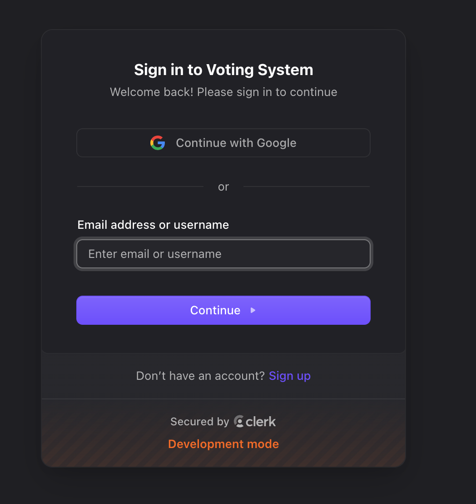
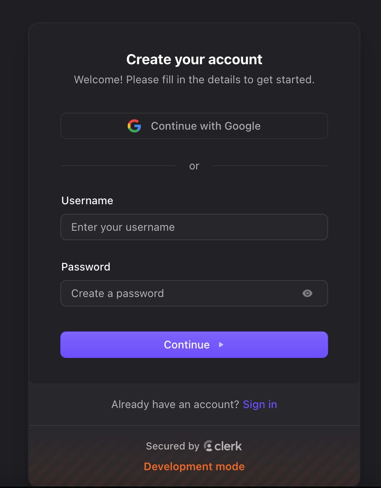
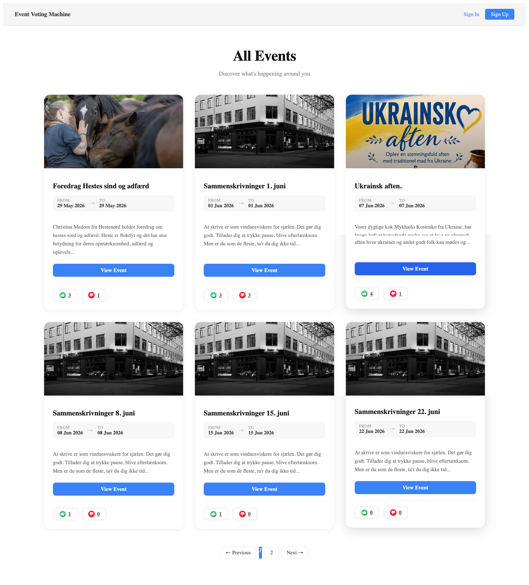
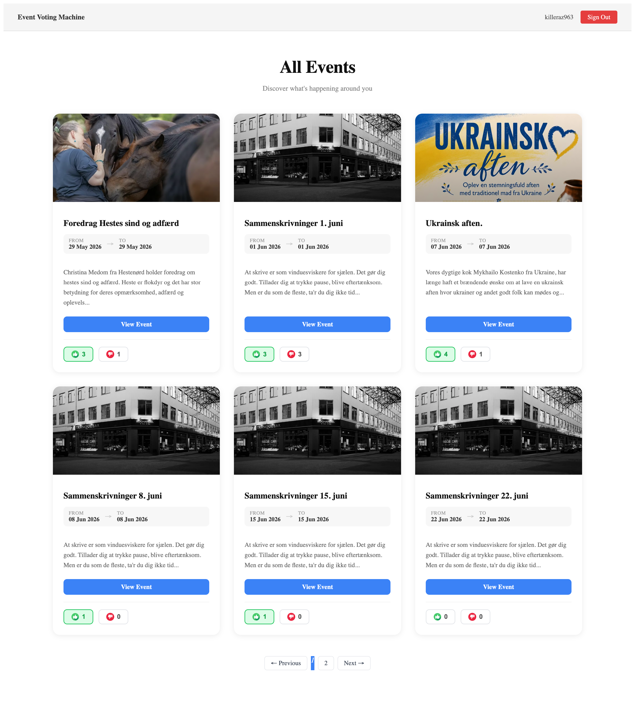

# Voting System — Rails 8 Application
 
A Ruby on Rails 8 application that fetches events from the Billetto API, displays them, and allows authenticated users to upvote or downvote events using an event-driven architecture powered by Rails Event Store.

---

## Table of Contents
 
- [Tech Stack](#tech-stack)
- [Features](#features)
- [Prerequisites](#prerequisites)
- [Setup & Installation](#setup--installation)
- [Environment & Credentials](#environment--credentials)
- [Database Setup](#database-setup)
- [Running the App](#running-the-app)
- [Authentication Flow (Clerk)](#authentication-flow-clerk)
- [Billetto API Integration](#billetto-api-integration)
- [Voting Feature (Rails Event Store)](#voting-feature-rails-event-store)
- [Background Jobs](#background-jobs)
- [Testing](#testing)
- [Project Structure](#project-structure)
- [Design Decisions](#design-decisions)

---

## Tech Stack
 
| Layer | Technology |
|---|---|
| Framework | Ruby on Rails 8.1 |
| Language | Ruby 4.0 |
| Database | PostgreSQL |
| Authentication | Clerk.com |
| Event Store | Rails Event Store (RES) |
| Background Jobs | Active Job |
| Pagination | will_paginate |
| HTTP Client | Net::HTTP (Billetto API) |
| Testing | RSpec, FactoryBot, Faker |

---

## Features
 
- **Event Listing** — Fetches and displays events from the Billetto API with title, image, dates, and description
- **Authentication** — Sign up, sign in, and sign out via Clerk.com hosted pages
- **Voting** — Authenticated users can upvote or downvote events
- **Guest Access** — Guests can browse events and see vote counts; clicking vote redirects to sign in
- **Event Store** — All votes are recorded as immutable events in Rails Event Store
- **Background Jobs** — Vote processing is handled asynchronously via Active Job
- **Upsert Import** — Events are imported from Billetto API with upsert to avoid duplicates

---
 
## Prerequisites
 
- Ruby 4.0+
- Rails 8.1+
- PostgreSQL
- Node.js (for asset pipeline)
- A [Clerk.com](https://clerk.com) account and Secret key
- A [Billetto](https://billetto.com) API key


---
 
## Setup & Installation
 
### 1. Clone the repository
 
```bash
git clone https://github.com/your-username/voting-system.git
cd voting-system
```
 
### 2. Install dependencies
 
```bash
bundle install
```
 
### 3. Setup credentials
 
```bash
rails credentials:edit
```
 
Add the following to your credentials file:
 
```yaml
clerk:
  publishable_key: pk_test_xxxxxxxxxxxxxxxxxxxx
  secret_key: sk_test_xxxxxxxxxxxxxxxxxxxx
  sign_in_url: https://your-clerk-domain.accounts.dev/sign-in
  sign_up_url: https://your-clerk-domain.accounts.dev/sign-up
  after_sign_in_url: http://localhost:3000
  after_sign_up_url: http://localhost:3000
 
billetto:
  api_key: your_billetto_api_key
  api_url: https://api.billetto.com
```
 
---
 
 ## Environment & Credentials
 
All secrets are stored using Rails encrypted credentials (`config/credentials.yml.enc`).
 
| Key | Description |
|---|---|
| `clerk.publishable_key` | Clerk frontend publishable key |
| `clerk.secret_key` | Clerk backend secret key |
| `clerk.sign_in_url` | Clerk hosted sign-in page URL |
| `clerk.sign_up_url` | Clerk hosted sign-up page URL |
| `clerk.after_sign_in_url` | Redirect URL after successful sign in |
| `clerk.after_sign_up_url` | Redirect URL after successful sign up |
| `billetto.api_key` | Billetto API key |
| `billetto.api_url` | Billetto API base URL |
 
---

## Database Setup
 
```bash
# Create databases
rails db:create
 
# Run migrations (includes Rails Event Store tables)
rails db:migrate
 
# Setup test database
rails db:create RAILS_ENV=test
rails db:migrate RAILS_ENV=test
```

---
 
## Running the App
 
```bash
# Start the Rails server
rails server

# Open rails console 
rails c
# Run Service to Import Events Data From Billetto API
ImportEventsService.new.call
```
 
Visit `http://localhost:3000`
 
---
 
## Authentication Flow (Clerk)
 
This app uses **Clerk's hosted authentication pages** — no embedded login forms.
 
```
Guest visits any protected page
  → Rails checks clerk.session (backend JWT verification)
  → No session → redirect to Clerk hosted sign-in page
  → User signs in on Clerk's domain
  → Clerk redirects back to after_sign_in_url
  → Rails verifies session → user accesses the app
```

### Key files
 
| File | Purpose |
|---|---|
| `config/initializers/clerk.rb` | Configures Clerk SDK with keys |
| `app/controllers/application_controller.rb` | Includes `Clerk::Authenticatable`, sets `@clerk_user` |
| `app/views/shared/_navbar.html.erb` | Shows Sign In/Sign Up or Sign Out based on session |
| `app/views/auth/sign_out.html.erb` | Calls `Clerk.signOut()` via JS then redirects |
 
### Controller protection
 
```ruby
# Public — guests can access
class EventsController < ApplicationController
  def index; end
end
 
# Protected — must be signed in
class VotesController < ApplicationController
  before_action :require_clerk_session!
end
```
---
 
## Billetto API Integration
 
Events are fetched from the [Billetto API](https://api.billetto.com/reference/list-public-events) and stored locally using upsert.
 
### Import service
 
`app/services/import_events_service.rb`
 
- Calls `Billetto::Client.new.get_events`
- Validates each event (requires id, title, url, startdate, enddate)
- Upserts valid records into the `events` table using `external_id` as unique key
- Logs and swallows errors gracefully
### Running the import
 
```bash
# Open rails console 
rails c
# Run Service to Import Events Data From Billetto API
ImportEventsService.new.call
```

### Event model
 
```
events
- external_id  (string, unique) — Billetto ID
- title        (string)
- description  (text)
- image_url    (string)
- event_url    (string)
- start_date   (date)
- end_date     (date)
```
---

## Voting Feature (Rails Event Store)
 
Votes are recorded as **immutable domain events** in Rails Event Store — not as mutable database records.
 
### Event types
 
| Event Class | Triggered when |
|---|---|
| `Events::Upvoted` | User clicks 👍 on an event |
| `Events::Downvoted` | User clicks 👎 on an event |
 
Each event stores:
 
```ruby
{
  event_id: 42,
  user_id:  "user_clerk_xyz",
  voted_at: "2026-05-08T10:00:00Z"
}
```

### Stream naming
 
Each event gets its own stream: `event-{event_id}`

### Reading votes
 
```ruby
# Get counts
VotingService.vote_counts(event.id)
# => { upvotes: 5, downvotes: 2 }
 
# Get user's last vote
VotingService.user_vote(event_id: event.id, user_id: clerk.user_id)
# => :upvoted | :downvoted | nil
```
 
### Vote flow
 
```
User clicks vote button (POST /events/:id/votes)
  → VotesController#create
  → Validates vote_type ("upvote" or "downvote")
  → Enqueues ProcessVoteJob
  → Redirects immediately (non-blocking)
  → [Background] ProcessVoteJob runs
  → VotingService publishes event to Rails Event Store
```
 
---

## Background Jobs
 
`ProcessVoteJob` handles vote processing asynchronously.
 
```ruby
ProcessVoteJob.perform_now(
  event_id:  "42",
  user_id:   "user_clerk_xyz",
  vote_type: "upvote"
)
```
 
- Queue: `default`
- Adapter: Rails 8 default
- On error: logs the error and re-raises for retry
---

## Testing
 
The test suite uses **RSpec** with FactoryBot and Faker.

### Setup
 
```bash
bundle exec rspec
```

### Run specific specs
 
```bash
# All tests
bundle exec rspec
 
# By folder
bundle exec rspec spec/models/
bundle exec rspec spec/services/
bundle exec rspec spec/controllers/
bundle exec rspec spec/jobs/
 
# Single file
bundle exec rspec spec/models/event_spec.rb
 
# With documentation format
bundle exec rspec --format documentation
```

### Test coverage
 
| Spec file | What it tests |
|---|---|
| `spec/models/event_spec.rb` | Validations, uniqueness, scopes, pagination |
| `spec/services/voting_service_spec.rb` | Upvote/downvote publishing, vote counts, user vote tracking |
| `spec/services/import_events_service_spec.rb` | API integration, record building, validation, upsert, error handling |
| `spec/controllers/events_controller_spec.rb` | Guest access, response status, template rendering |
| `spec/controllers/votes_controller_spec.rb` | Auth restriction, job enqueuing, invalid vote handling |
| `spec/jobs/process_vote_job_spec.rb` | Job execution, vote delegation, error handling, queue name |

---

## Design Decisions
 
**Clerk hosted pages over embedded components** — Using Clerk's hosted sign-in/sign-up pages avoids CORS issues on localhost and simplifies the Rails integration. No Clerk JS components needed for auth — only for sign-out.
 
**Rails Event Store for votes** — Votes are stored as immutable domain events rather than mutable DB records. This gives a full audit trail, makes vote history traceable per user, and demonstrates event-driven architecture as required by the spec.
 
**Background job for voting** — `ProcessVoteJob` decouples the HTTP request from the event store write. The user gets an instant redirect while the vote is processed asynchronously, making the UI feel faster.
 
**Upsert for event import** — Using `upsert_all` with `unique_by: :external_id` means the import can be run repeatedly (via cron or manually) without creating duplicates. Existing events are updated with fresh data from the API.
 
**Guest access to event listing** — The index page is intentionally public so users can browse events before deciding to sign up. Vote buttons redirect to Clerk sign-in if clicked by a guest, providing a smooth conversion flow.

# Voting System Screenshots

A modern Rails 8 voting application with Clerk authentication.

---

## Sign In Screen

<p align="center">
  
</p>

---

## Sign Up Screen

<p align="center">
  
</p>

---

## Home Page (Without Login)

<p align="center">
  
</p>

---

## Home Page (Logged In)

<p align="center">
  
</p>